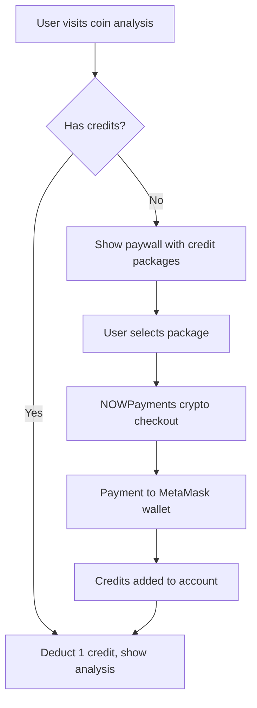

# TradeInsight Crypto Credit System Implementation Plan

## Overview

This document outlines the complete migration from Stripe subscription model to a NOWPayments-based crypto credit system where users purchase credits in bulk and spend them per coin analysis.

## Business Model

### Current (Stripe)

- $9.99/month subscription
- Unlimited analyses during subscription period
- Recurring billing challenges
- Fiat payment processing

### New (NOWPayments Credit System)

- Pay-per-use model: $0.25 per coin analysis
- Bulk credit purchases: $5, $10, $25 packages
- Crypto-native payment experience
- MetaMask wallet integration
- No recurring billing

## User Flow



### Detailed User Journey

1. **New User Experience**

   ```
   User lands on Bitcoin analysis page
   → Paywall: "Unlock this analysis for 1 credit ($0.25)"
   → "Buy Credits" button shows packages
   → User selects $10 package (40 credits + 20% bonus = 50 credits)
   → NOWPayments checkout with crypto options
   → User pays with preferred crypto to MetaMask wallet
   → Credits instantly added to account
   → Analysis unlocked automatically
   ```

2. **Returning User Experience**

   ```
   User with existing credits visits analysis
   → Header shows "Credits: 23"
   → Click analysis → 1 credit deducted instantly
   → Analysis loads immediately
   → Seamless experience, no payment friction
   ```

3. **Low Credit Warning**
   ```
   When credits < 5:
   → Show notification: "Running low on credits"
   → One-click top-up options
   → Auto-suggest most popular package
   ```

## Credit Package Structure

### Package Tiers

| Package     | Credits | USD Value | Bonus Credits | Total Credits | Cost per Analysis | Savings |
| ----------- | ------- | --------- | ------------- | ------------- | ----------------- | ------- |
| **Starter** | 20      | $5.00     | 0             | 20            | $0.25             | 0%      |
| **Popular** | 40      | $10.00    | 10 (25%)      | 50            | $0.20             | 20%     |
| **Premium** | 80      | $20.00    | 20 (25%)      | 100           | $0.20             | 20%     |
| **Whale**   | 200     | $50.00    | 50 (25%)      | 250           | $0.20             | 20%     |

### Credit Usage Model

- **Basic Analysis**: 1 credit ($0.25)
- **Premium AI Analysis**: 1 credit ($0.25)
- **Technical Indicators**: 1 credit ($0.25)
- **Export Features**: 1 credit ($0.25)
- **Historical Data**: 1 credit ($0.25)

_Note: All features cost the same to keep UX simple_

## NOWPayments Setup with MetaMask Wallet

### Prerequisites

1. **NOWPayments Account**
   - Sign up at [nowpayments.io](https://nowpayments.io)
   - Complete KYC verification
   - Get API key

2. **MetaMask Wallet Setup**
   - Install MetaMask browser extension
   - Create or import wallet
   - Add supported networks (Ethereum, Polygon, BSC, etc.)
   - Note wallet addresses for different networks

3. **Supported Cryptocurrencies**
   - **Bitcoin (BTC)** - Main network
   - **Ethereum (ETH)** - ERC-20
   - **USDT** - Multiple networks (ERC-20, TRC-20, BEP-20)
   - **USDC** - Multiple networks
   - **BNB** - Binance Smart Chain
   - **MATIC** - Polygon
   - **And 300+ other cryptocurrencies**

### NOWPayments Configuration Steps

1. **Account Setup**

   ```bash
   # Step 1: Register and verify NOWPayments account
   # Step 2: Navigate to Settings > API Keys
   # Step 3: Generate new API key
   # Step 4: Configure payout addresses
   ```

2. **Payout Wallet Configuration**

   ```json
   {
     "BTC": "your-metamask-bitcoin-address",
     "ETH": "0xYourMetaMaskEthereumAddress",
     "USDT_ERC20": "0xYourMetaMaskEthereumAddress",
     "USDT_TRC20": "your-tron-address",
     "BNB": "0xYourMetaMaskBSCAddress",
     "MATIC": "0xYourMetaMaskPolygonAddress"
   }
   ```

3. **Environment Variables**

   ```bash
   # Add to .env file
   VITE_NOWPAYMENTS_API_KEY=your_nowpayments_api_key
   VITE_NOWPAYMENTS_ENVIRONMENT=production # or sandbox
   VITE_METAMASK_WALLET_ADDRESS=0xYourMainMetaMaskAddress

   # Remove old Stripe variables
   # VITE_STRIPE_PUBLISHABLE_KEY=
   # VITE_STRIPE_PRICE_ID_MONTHLY=
   ```

## Technical Implementation

### Database Schema Changes

```sql
-- Remove old subscription tables, add credit system
DROP TABLE IF EXISTS subscriptions CASCADE;

-- User Credits Balance
CREATE TABLE user_credits (
  id UUID PRIMARY KEY DEFAULT gen_random_uuid(),
  user_id UUID REFERENCES users(id) ON DELETE CASCADE,
  balance INTEGER DEFAULT 0, -- Current credit balance
  total_purchased INTEGER DEFAULT 0, -- Lifetime credits purchased
  total_used INTEGER DEFAULT 0, -- Lifetime credits used
  created_at TIMESTAMP DEFAULT NOW(),
  updated_at TIMESTAMP DEFAULT NOW()
);

-- Credit Purchase History
CREATE TABLE credit_purchases (
  id UUID PRIMARY KEY DEFAULT gen_random_uuid(),
  user_id UUID REFERENCES users(id) ON DELETE CASCADE,
  package_type TEXT NOT NULL, -- 'starter', 'popular', 'premium', 'whale'
  credits_purchased INTEGER NOT NULL, -- Base credits (before bonus)
  bonus_credits INTEGER DEFAULT 0, -- Bonus credits awarded
  total_credits INTEGER NOT NULL, -- Total credits received
  usd_amount DECIMAL(10,2) NOT NULL, -- USD value
  crypto_currency TEXT NOT NULL, -- BTC, ETH, USDT, etc.
  crypto_amount DECIMAL(18,8) NOT NULL, -- Amount paid in crypto
  nowpayments_payment_id TEXT UNIQUE NOT NULL,
  payment_status TEXT DEFAULT 'pending', -- pending, completed, failed, expired
  payment_address TEXT, -- Address where user sent crypto
  transaction_hash TEXT, -- Blockchain transaction hash
  created_at TIMESTAMP DEFAULT NOW(),
  completed_at TIMESTAMP,

  -- Indexes for faster queries
  INDEX idx_user_purchases (user_id, created_at),
  INDEX idx_payment_status (payment_status),
  INDEX idx_nowpayments_id (nowpayments_payment_id)
);

-- Credit Usage History
CREATE TABLE credit_usage (
  id UUID PRIMARY KEY DEFAULT gen_random_uuid(),
  user_id UUID REFERENCES users(id) ON DELETE CASCADE,
  coin_symbol TEXT NOT NULL, -- BTC, ETH, etc.
  feature_type TEXT DEFAULT 'analysis', -- analysis, export, historical
  credits_used INTEGER DEFAULT 1,
  ip_address INET, -- For analytics
  user_agent TEXT, -- For analytics
  created_at TIMESTAMP DEFAULT NOW(),

  -- Indexes
  INDEX idx_user_usage (user_id, created_at),
  INDEX idx_coin_usage (coin_symbol, created_at)
);

-- Credit balance triggers for consistency
CREATE OR REPLACE FUNCTION update_credit_balance()
RETURNS TRIGGER AS $$
BEGIN
  IF TG_OP = 'INSERT' THEN
    -- Adding credits (purchase)
    IF TG_TABLE_NAME = 'credit_purchases' AND NEW.payment_status = 'completed' THEN
      INSERT INTO user_credits (user_id, balance, total_purchased)
      VALUES (NEW.user_id, NEW.total_credits, NEW.total_credits)
      ON CONFLICT (user_id)
      DO UPDATE SET
        balance = user_credits.balance + NEW.total_credits,
        total_purchased = user_credits.total_purchased + NEW.total_credits,
        updated_at = NOW();
    END IF;

    -- Using credits (usage)
    IF TG_TABLE_NAME = 'credit_usage' THEN
      UPDATE user_credits
      SET
        balance = balance - NEW.credits_used,
        total_used = total_used + NEW.credits_used,
        updated_at = NOW()
      WHERE user_id = NEW.user_id;
    END IF;
  END IF;

  RETURN COALESCE(NEW, OLD);
END;
$$ LANGUAGE plpgsql;

-- Apply triggers
CREATE TRIGGER trigger_credit_purchase_balance
  AFTER INSERT OR UPDATE ON credit_purchases
  FOR EACH ROW EXECUTE FUNCTION update_credit_balance();

CREATE TRIGGER trigger_credit_usage_balance
  AFTER INSERT ON credit_usage
  FOR EACH ROW EXECUTE FUNCTION update_credit_balance();
```

### File Structure Changes

```
src/
├── services/
│   ├── nowpayments.ts          # Replace stripe.ts
│   ├── credits.ts              # Credit management service
│   └── __tests__/
│       ├── nowpayments.test.ts
│       └── credits.test.ts
├── components/
│   ├── CreditBalance.tsx       # Show user's credit balance
│   ├── BuyCreditButton.tsx     # Replace UpgradeButton.tsx
│   ├── CreditPackages.tsx      # Credit package selection
│   ├── PaywallGuard.tsx        # Credit-based paywall
│   ├── CreditHistory.tsx       # Purchase/usage history
│   └── __tests__/
├── hooks/
│   ├── useCredits.ts           # Credit balance and operations
│   └── useNowPayments.ts       # Payment processing hook
├── types/
│   └── credits.ts              # Credit system types
└── contexts/
    └── CreditContext.tsx       # Global credit state
```

## Service Implementation

### NOWPayments Service (`src/services/nowpayments.ts`)

```typescript
import { supabase } from '../config/supabase'

export interface CreditPackage {
  id: 'starter' | 'popular' | 'premium' | 'whale'
  name: string
  credits: number
  bonusCredits: number
  totalCredits: number
  usdAmount: number
  popular?: boolean
}

export const CREDIT_PACKAGES: CreditPackage[] = [
  {
    id: 'starter',
    name: 'Starter',
    credits: 20,
    bonusCredits: 0,
    totalCredits: 20,
    usdAmount: 5.0,
  },
  {
    id: 'popular',
    name: 'Popular',
    credits: 40,
    bonusCredits: 10,
    totalCredits: 50,
    usdAmount: 10.0,
    popular: true,
  },
  {
    id: 'premium',
    name: 'Premium',
    credits: 80,
    bonusCredits: 20,
    totalCredits: 100,
    usdAmount: 20.0,
  },
  {
    id: 'whale',
    name: 'Whale',
    credits: 200,
    bonusCredits: 50,
    totalCredits: 250,
    usdAmount: 50.0,
  },
]

export interface PaymentRequest {
  price_amount: number
  price_currency: string
  pay_currency: string
  order_id: string
  order_description: string
  ipn_callback_url: string
  success_url: string
  cancel_url: string
}

export interface PaymentResponse {
  payment_id: string
  payment_status: string
  pay_address: string
  pay_amount: number
  pay_currency: string
  price_amount: number
  price_currency: string
  order_id: string
  order_description: string
  created_at: string
}

class NOWPaymentsService {
  private apiKey: string
  private baseUrl: string

  constructor() {
    this.apiKey = import.meta.env.VITE_NOWPAYMENTS_API_KEY
    this.baseUrl =
      import.meta.env.VITE_NOWPAYMENTS_ENVIRONMENT === 'sandbox'
        ? 'https://api-sandbox.nowpayments.io/v1'
        : 'https://api.nowpayments.io/v1'
  }

  private async makeRequest(endpoint: string, options: RequestInit = {}) {
    const response = await fetch(`${this.baseUrl}${endpoint}`, {
      ...options,
      headers: {
        'x-api-key': this.apiKey,
        'Content-Type': 'application/json',
        ...options.headers,
      },
    })

    if (!response.ok) {
      const error = await response.json()
      throw new Error(
        `NOWPayments API error: ${error.message || response.statusText}`
      )
    }

    return response.json()
  }

  async getAvailableCurrencies(): Promise<string[]> {
    const data = await this.makeRequest('/currencies')
    return data.currencies
  }

  async getMinimumPaymentAmount(currency: string): Promise<number> {
    const data = await this.makeRequest(
      `/min-amount?currency_from=${currency}&currency_to=usd`
    )
    return data.min_amount
  }

  async createPayment(paymentData: PaymentRequest): Promise<PaymentResponse> {
    return this.makeRequest('/payment', {
      method: 'POST',
      body: JSON.stringify(paymentData),
    })
  }

  async getPaymentStatus(paymentId: string): Promise<PaymentResponse> {
    return this.makeRequest(`/payment/${paymentId}`)
  }

  async createCreditPurchase(
    userId: string,
    packageId: string,
    payCurrency: string = 'btc'
  ): Promise<PaymentResponse> {
    const package_ = CREDIT_PACKAGES.find((p) => p.id === packageId)
    if (!package_) {
      throw new Error('Invalid package ID')
    }

    // Check minimum payment amount
    const minAmount = await this.getMinimumPaymentAmount(payCurrency)
    if (package_.usdAmount < minAmount) {
      throw new Error(
        `Minimum payment amount for ${payCurrency} is $${minAmount}`
      )
    }

    const orderId = `credit_${userId}_${Date.now()}`

    // Store pending purchase in database
    const { error } = await supabase.from('credit_purchases').insert({
      user_id: userId,
      package_type: packageId,
      credits_purchased: package_.credits,
      bonus_credits: package_.bonusCredits,
      total_credits: package_.totalCredits,
      usd_amount: package_.usdAmount,
      crypto_currency: payCurrency.toUpperCase(),
      crypto_amount: 0, // Will be updated by webhook
      nowpayments_payment_id: orderId, // Temporary, will be updated
      payment_status: 'pending',
    })

    if (error) {
      throw new Error(`Database error: ${error.message}`)
    }

    const paymentData: PaymentRequest = {
      price_amount: package_.usdAmount,
      price_currency: 'usd',
      pay_currency: payCurrency,
      order_id: orderId,
      order_description: `TradeInsight ${package_.name} Package - ${package_.totalCredits} credits`,
      ipn_callback_url: `${window.location.origin}/api/nowpayments/webhook`,
      success_url: `${window.location.origin}/credits/success`,
      cancel_url: `${window.location.origin}/credits/cancel`,
    }

    const payment = await this.createPayment(paymentData)

    // Update database with actual payment ID
    await supabase
      .from('credit_purchases')
      .update({
        nowpayments_payment_id: payment.payment_id,
        crypto_amount: payment.pay_amount,
        payment_address: payment.pay_address,
      })
      .eq('nowpayments_payment_id', orderId)

    return payment
  }
}

export const nowPaymentsService = new NOWPaymentsService()
```

### Credit Management Service (`src/services/credits.ts`)

```typescript
import { supabase } from '../config/supabase'

export interface UserCredits {
  balance: number
  totalPurchased: number
  totalUsed: number
}

export interface CreditUsage {
  coinSymbol: string
  featureType: string
  creditsUsed: number
  createdAt: string
}

export interface CreditPurchase {
  id: string
  packageType: string
  totalCredits: number
  usdAmount: number
  cryptoCurrency: string
  paymentStatus: string
  createdAt: string
}

class CreditService {
  async getUserCredits(userId: string): Promise<UserCredits | null> {
    const { data, error } = await supabase
      .from('user_credits')
      .select('balance, total_purchased, total_used')
      .eq('user_id', userId)
      .single()

    if (error && error.code !== 'PGRST116') {
      // Not found error
      throw new Error(`Error fetching credits: ${error.message}`)
    }

    return data || { balance: 0, totalPurchased: 0, totalUsed: 0 }
  }

  async useCredits(
    userId: string,
    coinSymbol: string,
    featureType: string = 'analysis',
    creditsToUse: number = 1
  ): Promise<boolean> {
    const credits = await this.getUserCredits(userId)

    if (!credits || credits.balance < creditsToUse) {
      throw new Error('Insufficient credits')
    }

    const { error } = await supabase.from('credit_usage').insert({
      user_id: userId,
      coin_symbol: coinSymbol,
      feature_type: featureType,
      credits_used: creditsToUse,
    })

    if (error) {
      throw new Error(`Error using credits: ${error.message}`)
    }

    return true
  }

  async getCreditHistory(
    userId: string,
    limit: number = 50
  ): Promise<{
    purchases: CreditPurchase[]
    usage: CreditUsage[]
  }> {
    const [purchaseResult, usageResult] = await Promise.all([
      supabase
        .from('credit_purchases')
        .select(
          'id, package_type, total_credits, usd_amount, crypto_currency, payment_status, created_at'
        )
        .eq('user_id', userId)
        .order('created_at', { ascending: false })
        .limit(limit),

      supabase
        .from('credit_usage')
        .select('coin_symbol, feature_type, credits_used, created_at')
        .eq('user_id', userId)
        .order('created_at', { ascending: false })
        .limit(limit),
    ])

    if (purchaseResult.error) {
      throw new Error(
        `Error fetching purchase history: ${purchaseResult.error.message}`
      )
    }

    if (usageResult.error) {
      throw new Error(
        `Error fetching usage history: ${usageResult.error.message}`
      )
    }

    return {
      purchases: purchaseResult.data.map((p) => ({
        id: p.id,
        packageType: p.package_type,
        totalCredits: p.total_credits,
        usdAmount: p.usd_amount,
        cryptoCurrency: p.crypto_currency,
        paymentStatus: p.payment_status,
        createdAt: p.created_at,
      })),
      usage: usageResult.data.map((u) => ({
        coinSymbol: u.coin_symbol,
        featureType: u.feature_type,
        creditsUsed: u.credits_used,
        createdAt: u.created_at,
      })),
    }
  }

  async hasCreditsForFeature(
    userId: string,
    requiredCredits: number = 1
  ): Promise<boolean> {
    const credits = await this.getUserCredits(userId)
    return credits ? credits.balance >= requiredCredits : false
  }

  // Webhook handler for NOWPayments
  async handlePaymentWebhook(
    webhookData: any
  ): Promise<{ success: boolean; message: string }> {
    try {
      const { payment_id, payment_status, order_id } = webhookData

      if (payment_status === 'finished') {
        // Payment completed - activate credits
        const { error } = await supabase
          .from('credit_purchases')
          .update({
            payment_status: 'completed',
            completed_at: new Date().toISOString(),
          })
          .eq('nowpayments_payment_id', payment_id)

        if (error) {
          return { success: false, message: `Database error: ${error.message}` }
        }

        return { success: true, message: 'Credits activated successfully' }
      } else if (payment_status === 'failed' || payment_status === 'expired') {
        // Payment failed - mark as failed
        await supabase
          .from('credit_purchases')
          .update({ payment_status: payment_status })
          .eq('nowpayments_payment_id', payment_id)

        return { success: true, message: `Payment ${payment_status}` }
      }

      return { success: true, message: 'Webhook processed' }
    } catch (error) {
      console.error('Webhook processing error:', error)
      return {
        success: false,
        message: `Error processing webhook: ${error instanceof Error ? error.message : 'Unknown error'}`,
      }
    }
  }
}

export const creditService = new CreditService()
```

## Component Implementation

### Credit Balance Component (`src/components/CreditBalance.tsx`)

```typescript
import React from 'react'
import { useCredits } from '../hooks/useCredits'

interface CreditBalanceProps {
  className?: string
  showDetails?: boolean
}

export const CreditBalance: React.FC<CreditBalanceProps> = ({
  className = '',
  showDetails = false
}) => {
  const { credits, isLoading, error } = useCredits()

  if (isLoading) {
    return (
      <div className={`animate-pulse ${className}`}>
        <div className="h-6 w-16 bg-gray-200 dark:bg-gray-700 rounded"></div>
      </div>
    )
  }

  if (error) {
    return (
      <div className={`text-red-500 text-sm ${className}`}>
        Error loading credits
      </div>
    )
  }

  const balance = credits?.balance || 0
  const isLow = balance < 5

  return (
    <div className={`flex items-center space-x-2 ${className}`}>
      <div className="flex items-center space-x-1">
        <svg
          className={`w-5 h-5 ${isLow ? 'text-orange-500' : 'text-blue-500'}`}
          fill="currentColor"
          viewBox="0 0 20 20"
        >
          <path d="M8.433 7.418c.155-.103.346-.196.567-.267v1.698a2.305 2.305 0 01-.567-.267C8.07 8.34 8 8.114 8 8c0-.114.07-.34.433-.582zM11 12.849v-1.698c.22.071.412.164.567.267.364.243.433.468.433.582 0 .114-.07.34-.433.582a2.305 2.305 0 01-.567.267z" />
          <path fillRule="evenodd" d="M10 18a8 8 0 100-16 8 8 0 000 16zm1-13a1 1 0 10-2 0v.092a4.535 4.535 0 00-1.676.662C6.602 6.234 6 7.009 6 8c0 .99.602 1.765 1.324 2.246.48.32 1.054.545 1.676.662v1.941c-.391-.127-.68-.317-.843-.504a1 1 0 10-1.51 1.31c.562.649 1.413 1.076 2.353 1.253V15a1 1 0 102 0v-.092a4.535 4.535 0 001.676-.662C13.398 13.766 14 12.991 14 12c0-.99-.602-1.765-1.324-2.246A4.535 4.535 0 0011 9.092V7.151c.391.127.68.317.843.504a1 1 0 101.511-1.31c-.563-.649-1.413-1.076-2.354-1.253V5z" clipRule="evenodd" />
        </svg>
        <span className={`font-medium ${isLow ? 'text-orange-600 dark:text-orange-400' : 'text-gray-900 dark:text-white'}`}>
          {balance} credits
        </span>
      </div>

      {isLow && (
        <span className="text-xs text-orange-500 bg-orange-50 dark:bg-orange-900/20 px-2 py-1 rounded">
          Low
        </span>
      )}

      {showDetails && credits && (
        <div className="text-xs text-gray-500 dark:text-gray-400">
          Used: {credits.totalUsed} | Purchased: {credits.totalPurchased}
        </div>
      )}
    </div>
  )
}
```

### Buy Credit Button (`src/components/BuyCreditButton.tsx`)

```typescript
import React, { useState } from 'react'
import { useAuth } from '../hooks/useAuth'
import { CreditPackages } from './CreditPackages'

interface BuyCreditButtonProps {
  className?: string
  size?: 'sm' | 'md' | 'lg'
  variant?: 'primary' | 'secondary'
  requiredCredits?: number
  coinSymbol?: string
  onPurchaseComplete?: () => void
}

export const BuyCreditButton: React.FC<BuyCreditButtonProps> = ({
  className = '',
  size = 'md',
  variant = 'primary',
  requiredCredits = 1,
  coinSymbol,
  onPurchaseComplete
}) => {
  const { user, isAuthenticated, login } = useAuth()
  const [showPackages, setShowPackages] = useState(false)

  const sizeClasses = {
    sm: 'px-4 py-2 text-sm',
    md: 'px-6 py-3 text-base',
    lg: 'px-8 py-4 text-lg',
  }

  const variantClasses = {
    primary: 'bg-blue-600 hover:bg-blue-700 text-white',
    secondary: 'bg-white hover:bg-gray-50 text-gray-900 border border-gray-300 dark:bg-gray-800 dark:text-white dark:border-gray-600',
  }

  const handleClick = async () => {
    if (!isAuthenticated) {
      await login()
      return
    }

    setShowPackages(true)
  }

  return (
    <>
      <div className={`text-center ${className}`}>
        <div className="mb-4">
          <div className="text-lg font-semibold text-gray-900 dark:text-white">
            {coinSymbol ? `Unlock ${coinSymbol} Analysis` : 'Buy Credits'}
          </div>
          <div className="text-sm text-gray-500 dark:text-gray-400">
            {requiredCredits} credit{requiredCredits > 1 ? 's' : ''} required ($0.25 each)
          </div>
        </div>

        <button
          onClick={handleClick}
          className={`${sizeClasses[size]} ${variantClasses[variant]} font-medium rounded-lg transition-colors duration-200 ${className}`}
        >
          {!isAuthenticated ? 'Sign In to Buy Credits' : 'Buy Credits'}
        </button>

        <div className="mt-3 space-y-1 text-xs text-gray-500 dark:text-gray-400 text-center">
          <div>💳 Pay with crypto</div>
          <div>⚡ Instant activation</div>
          <div>🔒 Secure NOWPayments</div>
        </div>
      </div>

      {showPackages && (
        <CreditPackages
          isOpen={showPackages}
          onClose={() => setShowPackages(false)}
          onPurchaseComplete={onPurchaseComplete}
        />
      )}
    </>
  )
}
```

## Migration Strategy

### Phase 1: Database & Backend (Week 1)

1. **Database Migration**
   ```bash
   # Create migration script
   npm run db:migrate:credit-system
   ```
2. **NOWPayments Setup**
   - Register account
   - Configure MetaMask wallet addresses
   - Test API integration
3. **Service Implementation**
   - Build NOWPayments service
   - Build credit management service
   - Add webhook handlers

### Phase 2: Frontend Components (Week 2)

1. **Replace Components**
   - `UpgradeButton.tsx` → `BuyCreditButton.tsx`
   - Add `CreditBalance.tsx` to header
   - Build `CreditPackages.tsx` modal
2. **Update Paywall Logic**
   - Modify `PaywallGuard.tsx` for credit checks
   - Update all analysis components
3. **Credit Management UI**
   - Build credit history page
   - Add low credit notifications

### Phase 3: Testing & Migration (Week 3)

1. **Testing**
   - Test all payment flows
   - Verify webhook handling
   - Load testing with multiple currencies
2. **User Migration**
   - Grant existing Stripe users 40 credits
   - Send migration emails
   - Maintain Stripe for 30-day grace period
3. **Monitoring Setup**
   - Payment success rate tracking
   - Credit usage analytics
   - Revenue monitoring

### Phase 4: Launch & Optimization (Week 4)

1. **Soft Launch**
   - Beta test with select users
   - Monitor payment success rates
   - Gather user feedback
2. **Full Launch**
   - Update documentation
   - Marketing campaign for new pricing
   - Support team training
3. **Optimization**
   - A/B test package pricing
   - Optimize conversion funnel
   - Add more payment options

## Environment Setup

### NOWPayments Configuration

```bash
# 1. Register at NOWPayments
https://account.nowpayments.io/

# 2. Complete KYC verification

# 3. Configure payout wallets
# Navigate to Settings > Payout Settings
# Add MetaMask addresses for different networks:
# - BTC: Bitcoin address
# - ETH: Ethereum address (0x...)
# - USDT: Ethereum address for ERC-20
# - BNB: BSC address for BEP-20
# - MATIC: Polygon address

# 4. Generate API key
# Navigate to Settings > API Keys
# Create new API key with full permissions

# 5. Update .env file
VITE_NOWPAYMENTS_API_KEY=your_api_key_here
VITE_NOWPAYMENTS_ENVIRONMENT=production
VITE_METAMASK_WALLET_ADDRESS=0xYourMainAddress
```

### Webhook Configuration

```bash
# Set up webhook endpoint in NOWPayments dashboard
# Webhook URL: https://your-domain.com/api/nowpayments/webhook
# Events: payment.finished, payment.failed, payment.expired
```

## Success Metrics

### Key Performance Indicators (KPIs)

- **Conversion Rate**: % of visitors who purchase credits
- **Average Purchase Value**: Average USD per credit purchase
- **Credit Usage Rate**: % of purchased credits actually used
- **User Retention**: % of users who make repeat purchases
- **Payment Success Rate**: % of successful crypto payments
- **Customer Acquisition Cost (CAC)**: Cost to acquire paying users

### Target Metrics

- Payment success rate: >95%
- Conversion rate: >3% (vs current subscription model)
- Average purchase value: $15 (Popular package)
- Credit usage rate: >80%
- User retention (30-day): >60%

### Analytics Implementation

```typescript
// Track key events
analytics.track('Credit Package Selected', { packageId, usdAmount })
analytics.track('Payment Initiated', { currency, amount })
analytics.track('Payment Completed', { packageId, credits })
analytics.track('Credit Used', { coinSymbol, featureType })
analytics.track('Low Credit Warning', { remainingCredits })
```

## Risk Mitigation

### Technical Risks

1. **Payment Failures**
   - Implement retry logic
   - Clear error messages
   - Support team escalation
2. **Webhook Reliability**
   - Implement idempotency
   - Manual payment verification tools
   - Payment status checking
3. **Credit Balance Accuracy**
   - Database constraints
   - Transaction logging
   - Regular balance audits

### Business Risks

1. **User Adoption**
   - Gradual migration with grace period
   - Clear value communication
   - User support during transition
2. **Revenue Impact**
   - Monitor revenue per user
   - Adjust pricing based on usage patterns
   - A/B test different approaches

## Conclusion

This crypto credit system will provide:

- **Better user experience** - Pay only for what you use
- **Higher conversion** - Lower barrier to entry ($5 vs $9.99/month)
- **Crypto-native experience** - Aligns with target audience
- **Improved unit economics** - Higher per-analysis revenue
- **Reduced churn** - No subscription cancellations

The implementation plan provides a structured approach to migrate from Stripe to NOWPayments while maintaining service quality and user satisfaction.

## Next Steps

1. **Review and approve this plan**
2. **Set up NOWPayments account and MetaMask integration**
3. **Begin Phase 1: Database and backend implementation**
4. **Schedule user communication about the upcoming changes**
5. **Prepare testing and monitoring infrastructure**

---

_This plan can be executed iteratively with continuous user feedback and optimization._
